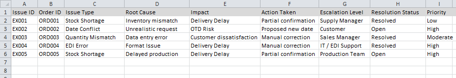

# Order Exception & Escalation Tracker

## Overview
This project documents a structured approach to handling order and delivery exceptions in customer supply operations.

The goal is to resolve issues early, escalate clearly, and prevent repeat failures.

## Common Exceptions
- Quantity mismatch
- Delivery date conflicts
- Stock unavailability
- Data inconsistencies

## Escalation Approach
- Validate issue with data
- Propose feasible alternatives
- Escalate with clear context
- Document resolution

## Skills Demonstrated
- Issue management
- Root cause analysis
- Escalation discipline
- Process documentation

## Relevance
Effective exception handling is critical to maintaining on-time delivery and customer trust.

## Sample View

